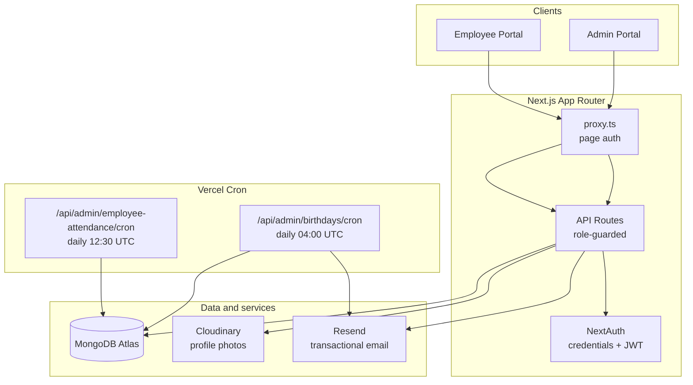
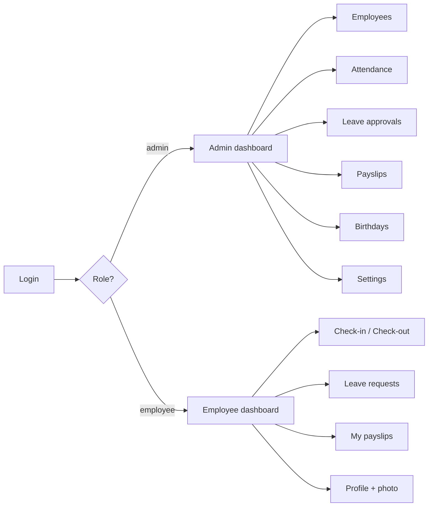
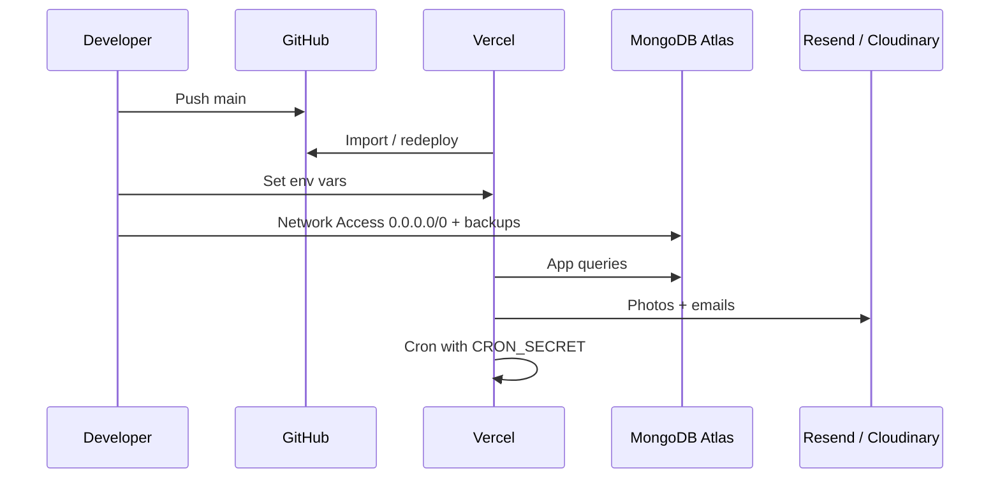
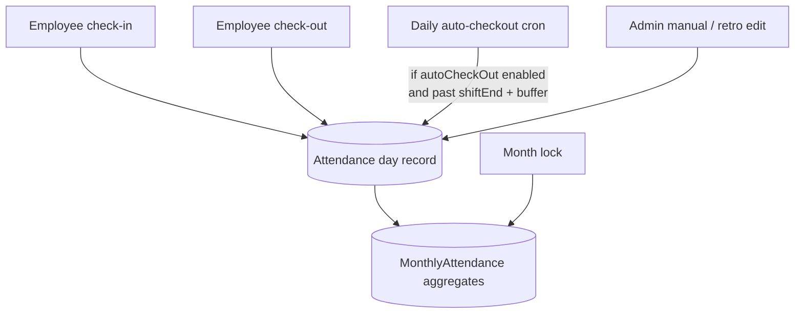

# HR Management System

A production-ready **Human Resources portal** for small and mid-size teams.  
Admins manage people, attendance, leave, and payroll. Employees self-serve check-in, leave requests, payslips, and profile updates — all behind role-based authentication.

---

## What this project solves

| Problem | How this app helps |
|---------|-------------------|
| Scattered employee records | Central employee directory with soft-delete |
| Manual attendance tracking | Web check-in / check-out + shift rules + auto check-out cron |
| Leave chaos | Policies, balances, and approval workflow |
| Payslip emails / PDFs | Generate, version, and download payslips |
| Forgotten birthdays | Daily cron emails via Resend |
| Weak access control | NextAuth JWT + admin / employee roles |

---

## System overview



### Role flows



---

## Features

### Admin
- Employee CRUD (soft-delete → `Inactive`, login user removed on delete)
- Attendance timesheets, manual / retro edits, monthly locking
- Shift rules: start/end, grace period, display windows, auto check-out buffer
- Leave policies (global + per employee) and approvals
- Payslip generation with PDF download
- Birthday tracker + automated emails
- Activity log and company settings

### Employee
- Check-in / check-out (Asia/Karachi timezone)
- Attendance history and monthly stats
- Leave requests with live balances
- Own payslips only
- Profile + Cloudinary photo upload (server-side)
- Birthday greeting on dashboard

### Auth and security
- NextAuth credentials + JWT
- Roles: `admin` | `employee`
- `tokenVersion` for global session invalidation
- Password reset via Resend
- Admin APIs guarded with `getAdminUser()`
- Cron routes require `Authorization: Bearer $CRON_SECRET`

---

## Tech stack

| Layer | Choice |
|-------|--------|
| Framework | Next.js 16 (App Router) + React 19 |
| Language | TypeScript (strict) |
| Database | MongoDB Atlas + Mongoose |
| Auth | NextAuth v4 (JWT) |
| UI | Tailwind CSS v4 |
| Media | Cloudinary |
| Email | Resend |
| Hosting | Vercel (+ Cron) |

---

## Project structure (high level)

```
app/
  (admin)/admin/     # Admin UI pages
  (employee)/employee/  # Employee UI pages
  api/               # REST handlers (auth + business APIs)
lib/                 # auth, mongodb, cloudinary, email helpers
modals/              # Mongoose models
scripts/             # seed-admin, db:test, test:email
proxy.ts             # Page-level route protection
vercel.json          # Cron schedules
```

---

## Quick start

### 1. Install

```bash
npm install
```

### 2. Environment

```bash
cp .env.example .env
```

Fill values from `.env.example`. Minimum for local run:

| Variable | Purpose |
|----------|---------|
| `MONGODB_URI` | Atlas connection string |
| `NEXTAUTH_SECRET` | JWT signing (`openssl rand -base64 32`) |
| `NEXTAUTH_URL` | `http://localhost:3000` locally |
| `CRON_SECRET` | Protects cron endpoints |
| `RESEND_API_KEY` / `RESEND_FROM_EMAIL` | Emails |
| `CLOUDINARY_*` or `CLOUDINARY_URL` | Profile photos |

### 3. Seed first admin

```bash
# In .env (temporary):
# SEED_ADMIN_EMAIL=admin@syncup.com
# SEED_ADMIN_PASSWORD=YourSecurePassword

npm run seed:admin

# Then remove SEED_ADMIN_PASSWORD from .env
```

### 4. Run

```bash
npm run db:test    # optional: verify MongoDB
npm run dev        # http://localhost:3000
```

---

## Scripts

| Command | Description |
|---------|-------------|
| `npm run dev` | Development server |
| `npm run build` | Production build |
| `npm start` | Serve production build |
| `npm run lint` | ESLint |
| `npm run db:test` | Test MongoDB connection |
| `npm run seed:admin` | Create / update admin user |
| `npm run test:email` | Send a Resend test email |

```bash
TEST_EMAIL=you@gmail.com npm run test:email
```

---

## Deploy on Vercel



### Steps

1. Push this repo to GitHub and import it in Vercel.
2. Set **all** production env vars (see table above).  
   - `NEXTAUTH_URL` = your live URL, e.g. `https://hr.yourdomain.com`
3. MongoDB Atlas → **Network Access** → allow Vercel (`0.0.0.0/0` is fine for serverless). Enable backups.
4. Deploy. Seed admin once against the production database (`npm run seed:admin` locally with prod `MONGODB_URI`).
5. Confirm crons in Vercel → **Crons**:
   - Birthdays: `/api/admin/birthdays/cron` — `0 4 * * *` (04:00 UTC ≈ 09:00 PKT)
   - Auto check-out: `/api/admin/employee-attendance/cron` — `30 12 * * *` (12:30 UTC ≈ 17:30 PKT)

Both crons **require** `CRON_SECRET`. Vercel sends `Authorization: Bearer <CRON_SECRET>` automatically.

---

## Attendance model (important)



- Timezone: **Asia/Karachi**
- Auto check-out uses `shiftEnd + autoCheckOutBuffer` (not a separate `autoCheckOutTime`)
- Locked months are **not** reopened by sync / cron
- When auto check-out is **off**, forgotten open shifts stay open for admin correction (no silent corruption)

> Biometric fingerprint machines are **not** integrated yet. Admin “Refresh Attendance” only reloads data from MongoDB.

---

## Security notes

- Never commit `.env` (ignored via `.gitignore`; only `.env.example` is tracked)
- Rotate secrets if they were ever pushed historically
- Keep `CRON_SECRET` set in production — cron routes reject requests without it
- Employees can only access their own payslips / leave / attendance
- Profile photo upload goes through an authenticated API (API secret stays server-side)

---

## Production smoke checklist

After deploy:

- [ ] Admin login
- [ ] Employee login
- [ ] Create employee → welcome email received
- [ ] Forgot password → reset link uses production `NEXTAUTH_URL`
- [ ] Profile photo upload
- [ ] Check-in / check-out
- [ ] Create payslip + PDF download
- [ ] Leave request + admin approval
- [ ] Cron endpoints return `401` without secret (expected)

---

## License

Private / proprietary — all rights reserved unless otherwise stated by the repository owner.
